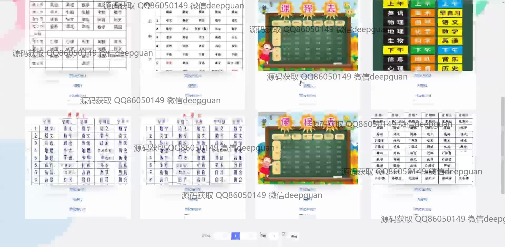
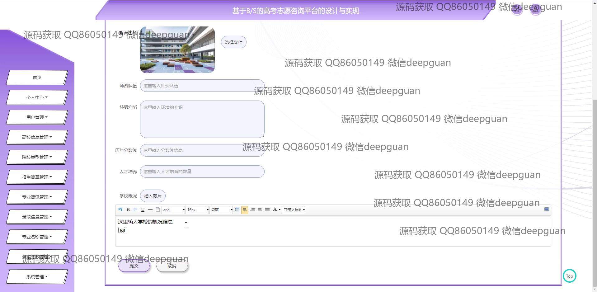
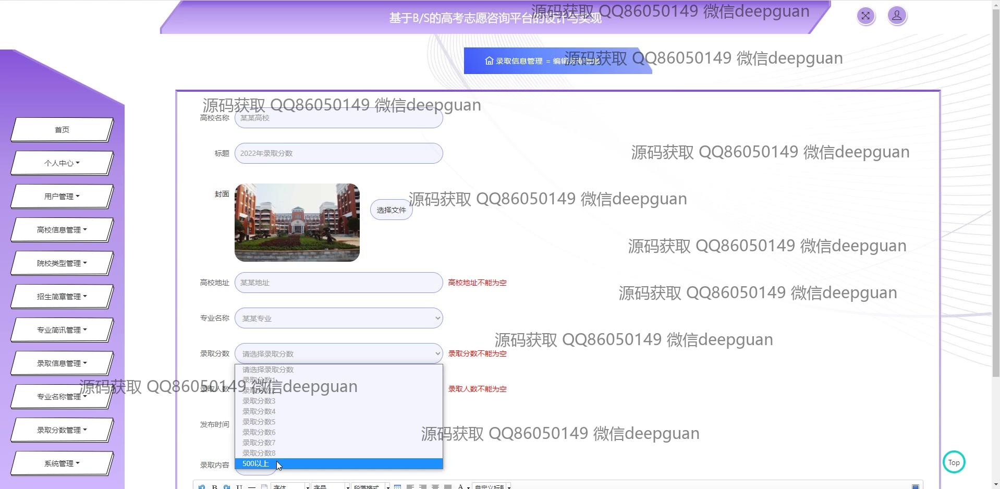

<h1 align="center">基于B_S的高考志愿咨询平台的设计与实现</h1>

## 简介
高考志愿咨询平台：角色分为管理员、用户；提供用户注册与登录、志愿填报指导、院校信息查询、专业推荐、模拟填报、在线咨询等功能。    --计算机毕业设计源码；毕设源码；java毕业设计源码

## 联系方式

<h3 align="center">获取完整代码与数据库文件 + 微信：deepguan QQ: 86050149 QQ群: 783742310</h3>

<h3 align="center">可帮忙远程部署 包运行成功！提供远程部署、修改代码、设计文档指导、代码讲解等服务！</h3>

## 功能介绍（完整见运行截图）
管理员：用户管理、注册及密码管理功能，支持用户信息的录入与编辑。高校信息管理，包括院校信息录入、修改和搜索，支持招生简章和专业信息的管理与更新。平台支持公告信息的发布与编辑，并提供在线咨询的管理功能，帮助管理员与用户进行有效的交流。

普通用户：用户界面提供注册、登陆、个人资料管理等基本功能。平台服务包括高考志愿填报指导、院校信息查询、专业推荐，以及历年录取数据分析。用户可以通过平台进行智能推荐和模拟填报，获取个性化的志愿建议。此外，用户可以通过在线咨询沟通获取专业顾问的根据高考成绩与个人兴趣进行的建议。

## 运行截图

本代码来源于网络,仅供学习参考使用!

